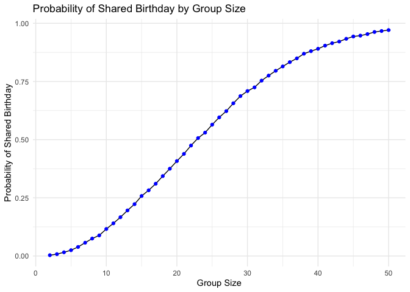
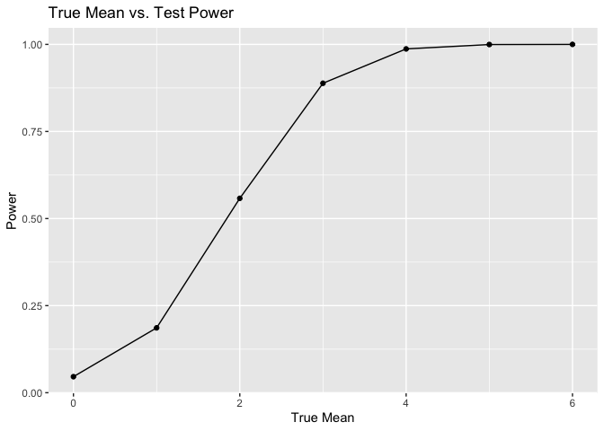
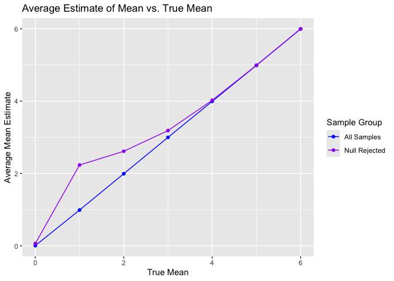
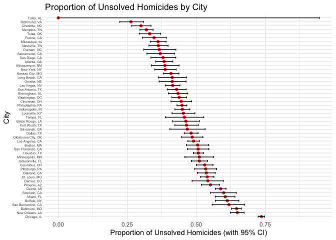

p8105_hw5_gp2770
================
Gokul Pareek
2024-11-11

``` r
library(tidyverse)
```

    ## ── Attaching core tidyverse packages ──────────────────────── tidyverse 2.0.0 ──
    ## ✔ dplyr     1.1.4     ✔ readr     2.1.5
    ## ✔ forcats   1.0.0     ✔ stringr   1.5.1
    ## ✔ ggplot2   3.5.1     ✔ tibble    3.2.1
    ## ✔ lubridate 1.9.3     ✔ tidyr     1.3.1
    ## ✔ purrr     1.0.2     
    ## ── Conflicts ────────────────────────────────────────── tidyverse_conflicts() ──
    ## ✖ dplyr::filter() masks stats::filter()
    ## ✖ dplyr::lag()    masks stats::lag()
    ## ℹ Use the conflicted package (<http://conflicted.r-lib.org/>) to force all conflicts to become errors

``` r
library(ggplot2)
```

# Problem 1

``` r
set.seed(123)

# Function for Shared Birthday
shared_birthday <- function(n) {
  birthdays <- sample(1:365, n, replace = TRUE)
  return(any(duplicated(birthdays)))
}

# Parameters
num_simulations <- 10000
group_sizes <- 2:50
probabilities <- numeric(length(group_sizes))

# Simulations for each group size
for (i in seq_along(group_sizes)) {
  n <- group_sizes[i]
  results <- replicate(num_simulations, shared_birthday(n))
  probabilities[i] <- mean(results)
}

# Create a data frame for plotting
birthday_df <- data.frame(GroupSize = group_sizes, Probability = probabilities)

# Plot
ggplot(birthday_df, aes(x = GroupSize, y = Probability)) +
  geom_line(color = "black") +
  geom_point(color = "blue") +
  labs(
    title = "Probability of Shared Birthday by Group Size",
    x = "Group Size",
    y = "Probability of Shared Birthday"
  ) +
  theme_minimal()
```

<!-- -->

The likelihood of at least two people sharing a birthday increases as
the group grows larger. For smaller groups, the probability is very low
because the chances of a match are slim. However, as the group size
approaches 50, the probability climbs significantly, nearing certainty.
This indicates that it becomes almost guaranteed for at least one pair
to have the same birthday.

# Problem 2

## Setting Initial Parameters

``` r
library(broom)

sample_size <- 30
standard_dev <- 5
true_mean_0 <- 0
num_reps <- 5000
significance_level <- 0.05
```

## Generating Data and Results

``` r
# Generate datasets and calculate mean estimates and p-values
simulate_data <- function(mean_value, sample_size, standard_dev, num_reps) {
  tibble(
    rep_id = seq_len(num_reps),
    samples = replicate(num_reps, rnorm(sample_size, mean = mean_value, sd = standard_dev), simplify = FALSE)
  ) %>% 
  mutate(
    mean_estimates = map_dbl(samples, mean),
    t_test_results = map(samples, ~ broom::tidy(t.test(.x, mu = 0, conf.level = 0.95))),
    p_values = map_dbl(t_test_results, "p.value")
  ) %>% 
  select(rep_id, mean_estimates, p_values)
}
```

## Creating a Table for Each Mean Value

``` r
mean_values <- c(0, 1, 2, 3, 4, 5, 6)

simulation_results <- tibble(
  true_mean = mean_values,
  results = map(mean_values, ~ simulate_data(mean_value = .x, sample_size = sample_size, standard_dev = standard_dev, num_reps = num_reps))
) %>% 
  unnest(results) %>% 
  select(-rep_id)
```

## Plotting Power vs. True Mean

``` r
simulation_results %>% 
  group_by(true_mean) %>% 
  summarize(
    rejection_rate = mean(p_values < significance_level)
  ) |>
  ggplot(aes(x = true_mean, y = rejection_rate)) +
  geom_point() +
  geom_line() +
  labs(
    title = "True Mean vs. Test Power",
    x = "True Mean",
    y = "Power"
  )
```

<!-- -->

The plot shows that as effect size (true mean) increases, the power of
the test also increases, indicating a higher likelihood of correctly
rejecting the null hypothesis. For larger effect sizes, the power
approaches 1, meaning the test almost always detects the effect.

## Plotting Average Estimates of mean_estimates

``` r
simulation_results %>% 
  group_by(true_mean) %>% 
  summarize(
    avg_all_samples = mean(mean_estimates),
    avg_rejected_samples = mean(mean_estimates[p_values < significance_level])
  ) |>
  ggplot(aes(x = true_mean)) +
  geom_line(aes(y = avg_all_samples, color = "All Samples")) +
  geom_point(aes(y = avg_all_samples, color = "All Samples")) +
  geom_line(aes(y = avg_rejected_samples, color = "Null Rejected")) +
  geom_point(aes(y = avg_rejected_samples, color = "Null Rejected")) +
  labs(
    title = "Average Estimate of Mean vs. True Mean",
    x = "True Mean",
    y = "Average Mean Estimate",
    color = "Sample Group"
  ) +
  scale_color_manual(
    values = c("All Samples" = "blue", "Null Rejected" = "purple")
  )
```

<!-- -->

The sample average of $\hat{\mu}$ across tests where the null is
rejected is approximately close to the true mean $\mu$, but it tends to
be slightly biased upward. This is due to the selection effect, where
only estimates significantly different from zero are included, causing
an overestimation, especially at higher values of $\mu$.

# Problem 3

``` r
homicide_data <- read.csv("data/homicide-data.csv")
```

This dataset includes 52,179 records of homicide cases, each providing
information on the victim’s demographics (name, race, age, and sex) and
the incident’s details, including the date, location (city, state,
latitude, and longitude), and case status (disposition). The disposition
column indicates whether the case was resolved, often specifying if it
was closed by arrest. Latitude and longitude values are missing for some
entries.

``` r
# Create city_state variable and summarize data
homicide_summary <- homicide_data %>%
  mutate(city_state = paste(city, state, sep = ", ")) %>%
  group_by(city_state) %>%
  summarize(
    total_homicides = n(),
    unsolved_homicides = sum(disposition %in% c("Closed without arrest", "Open/No arrest"))
  ) %>%
  ungroup()

# Filter data for Baltimore, MD
baltimore_data <- filter(homicide_summary, city_state == "Baltimore, MD")

# Use prop.test and tidy the output
baltimore_test <- prop.test(baltimore_data$unsolved_homicides, baltimore_data$total_homicides)
baltimore_tidy <- broom::tidy(baltimore_test)

# Extract proportion estimate and confidence intervals for Baltimore
baltimore_proportion <- baltimore_tidy$estimate
baltimore_conf_int <- c(baltimore_tidy$conf.low, baltimore_tidy$conf.high)
baltimore_proportion
```

    ##         p 
    ## 0.6455607

``` r
baltimore_conf_int
```

    ## [1] 0.6275625 0.6631599

``` r
# Apply prop.test for each city and extract proportions and CIs
homicide_proportions <- homicide_summary %>%
  mutate(
    test_results = map2(unsolved_homicides, total_homicides, ~ broom::tidy(prop.test(.x, .y))),
    proportion = map_dbl(test_results, "estimate"),
    conf_low = map_dbl(test_results, "conf.low"),
    conf_high = map_dbl(test_results, "conf.high")
  ) %>%
  select(city_state, proportion, conf_low, conf_high)
```

    ## Warning: There was 1 warning in `mutate()`.
    ## ℹ In argument: `test_results = map2(...)`.
    ## Caused by warning in `prop.test()`:
    ## ! Chi-squared approximation may be incorrect

``` r
# Reorder cities based on proportion of unsolved homicides
homicide_proportions <- homicide_proportions %>%
  arrange(desc(proportion)) %>%
  mutate(city_state = factor(city_state, levels = city_state))

# Plot the proportions with confidence intervals
ggplot(homicide_proportions, aes(x = city_state, y = proportion)) +
  geom_point(color = "red") +
  geom_errorbar(aes(ymin = conf_low, ymax = conf_high), width = 0.5) +
  coord_flip() +
  labs(
    title = "Proportion of Unsolved Homicides by City",
    x = "City",
    y = "Proportion of Unsolved Homicides (with 95% CI)"
  ) +
  theme_minimal() +
  theme(
    axis.text.y = element_text(size = 5, hjust = 1, vjust = 0.5), # Adjust text size and spacing
  ) 
```

<!-- -->
